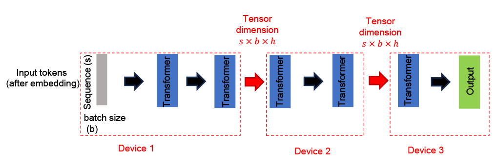

# LLM Inference in Distributed Edge Networks

This repository contains the implementation and experiments for optimizing LLM inference in distributed edge networks, focusing on efficient activation quantization strategies across edge device boundaries.



## 📄 Project Report
[Read the full project report here](https://drive.google.com/file/d/1IVqvSefE0aAV7FTzlgBU-mSlJ0hLE7A1/view?usp=sharing)

## 📂 Project Resources
- [Google Drive with Project Materials](https://drive.google.com/drive/folders/1EdB_8v9N-h4qKoRqifCczwwsVBsOZzLA?usp=sharing)
  - Meeting summaries and discussions
  - Contains the .pkl files referenced in this codebase.

## 🚀 Project Overview
This project investigates optimal activation quantization strategies in distributed LLM inference scenarios. The code simulates a simple case:

> *Given two edge devices with a split LLM, what's the most effective way to quantize activations crossing the device boundary?*

**Key Objectives:**
- Minimize perplexity degradation
- Maximize communication compression
- Evaluate different importance metrics for quantization

## 🚀 Getting Started

### Prerequisites
The code was ran on these versions. Other versions may work, but are not guaranteed to.
- Python 3.10+
- CUDA 12.4 (for GPU acceleration)
- PyTorch 2.4+

### Installation
1. Clone the repository:
   ```bash
   git clone <repository-url>
   cd act_quant_edge
   ```

2. Install dependencies:
   ```bash
   pip install -r requirements.txt
   ```

## 🧪 Running Experiments
1. Navigate to the experiment directory:
   ```bash
   cd experiments/<particular experiement>
   ```
2. Update the parameters in `params.json` if needed
3. Run the experiment:
   ```bash
   python main.py
   ```

## 🛠️ Technical Approach

### Importance Metrics Explored
1. **Layer-Wise Importance Analysis**
   - Investigates correlation between early and late layer importance scores
   - Explores optimization strategies based on layer-specific vs. final-layer importance

2. **Column-wise importance scoring**
   For each token j in layer l:
   - Compute importance I as: I<sup>l</sup><sub>j</sub> = (1/seq_len) * Σ<sub>i=1</sub><sup>seq_len</sup> A<sup>l</sup><sub>i,j</sub>
   - This measures the average attention token j receives across all positions in the attention matrix A.

3. **Last Row Importance**
   - Average attention distribution from the last row of attention matrices

### Evaluation
- **Dataset**: [WikiText test set](https://huggingface.co/datasets/Salesforce/wikitext)
- **Metrics**: Perplexity (following [Hugging Face's implementation](https://huggingface.co/docs/transformers/en/perplexity))
- **Framework**: PyTorch with Hugging Face Transformers
- **Other libraries**: Uses [lxt](https://github.com/rachtibat/LRP-eXplains-Transformers) for relevance scoring

## 🖥️ Environment Setup
The python code is designed to run on VMs. More specifically, the exact configuration of the machines the code was ran on is shown below: 
### Recommended Configuration
- **Platform**: Google Cloud Platform (GCP) VMs
- **Image**: Deep Learning VM for PyTorch 2.4
- **Specs**:
  - CUDA 12.4
  - Debian 11
  - Python 3.10
  - PyTorch 2.4

### Alternative: Google Colab
For testing and development, Colab-compatible notebooks are provided in the repository.

## 📁 Repository Structure
```
Edge_Inference/
├── Experiments/
│   ├── Pythia-70M/           # For running experiments on Pythia-70M.  
│   │   ├── main.py
│   │   ├── params.json
│   │   └── pythia_model.py   # Contains layer wise implementations
│   │
│   ├── Qwen2-0.5B/           # For running experiments on Qwen2 0.5B. 
│   │   ├── main.py
│   │   ├── params.json
│   │   └── qwen_layer_wise.py
│   │
│   └── Relevance/            # Determining importance of individual  
│       ├── main.py             attention heads using relevance scores.
│       └── params.json
│
├── Notebooks/                # Jupyter notebooks for analysis
│   ├── attention_head_weights_via_relevance.ipynb
│   ├── distributions_distance_across_layers.ipynb
│   └── qwen2-0.5B_experiment.ipynb
│
├── assets/                   # Static assets (images, etc.)
├── .gitignore                # Git ignore file
└── requirements.txt          # Python dependencies
```